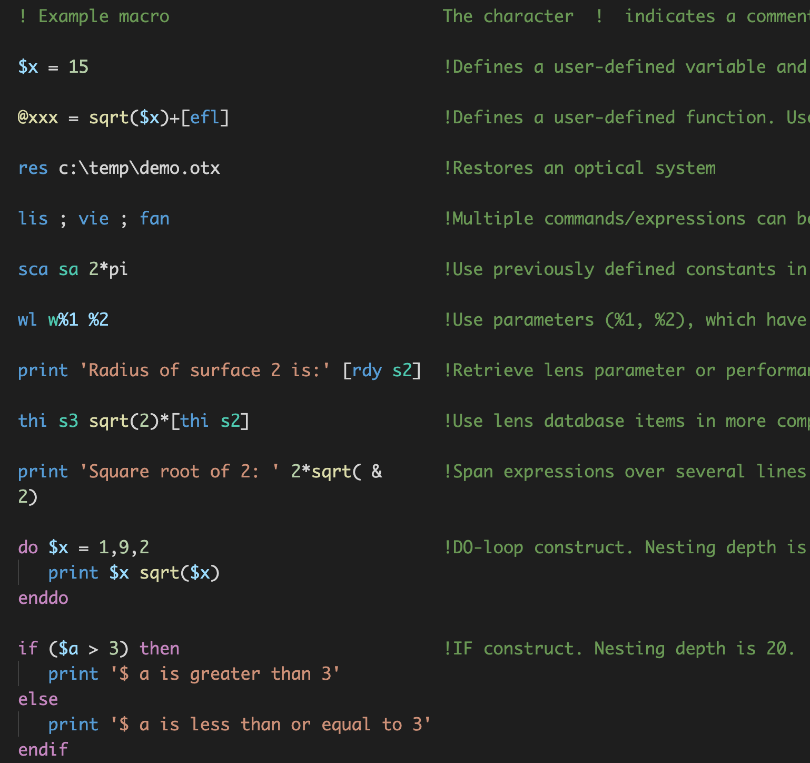

# OpTaliX Macro language support for Visual Studio Code

This extension adds syntax highlighting for [OpTaliX](http://www.optenso.com/index.html) macros.

## Screenshot

## Note
Example macro is introduced [here](http://www.optenso.com/optix/ex_macro.html).

## Changelog
Read the [CHANGELOG](CHANGELOG.md) to know what has changed over the last few versions of this extension.

## License
This extension is licensed under MIT license. See [LICENSE](LICENSE) for details.

## Contributing
Contributions are greatly appreciated. Please fork this repository and open a pull request to add snippets, make grammar tweaks, etc.
